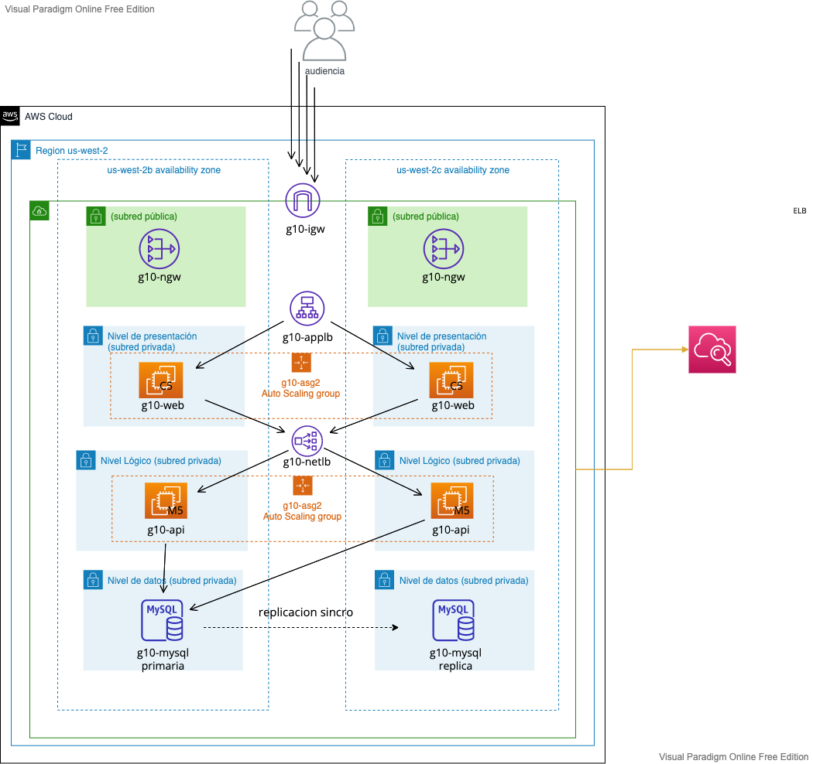
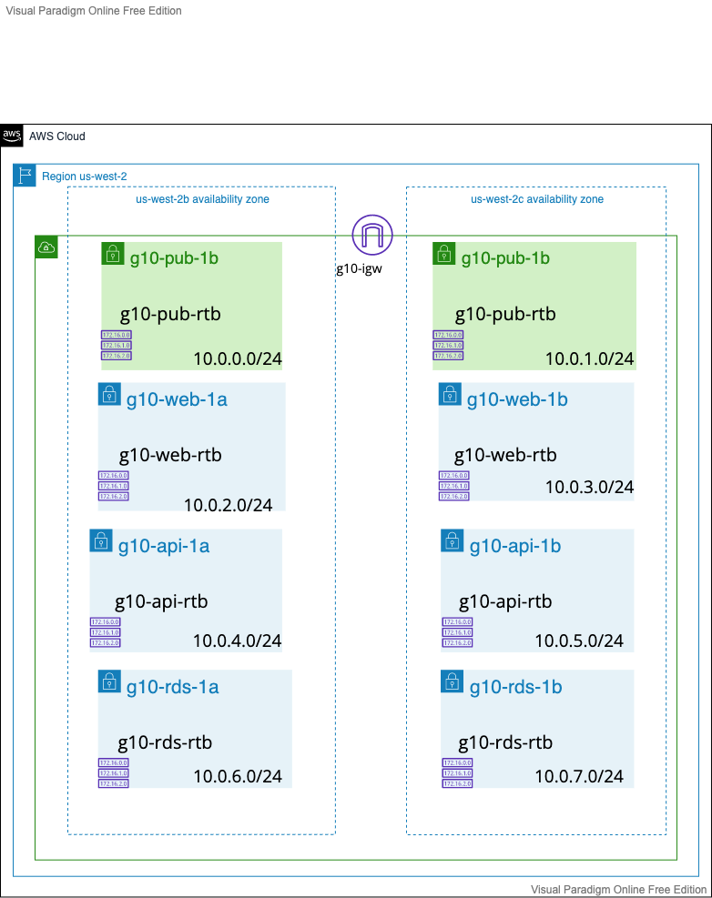

# Diseño de la arquitectura y estrategia de gestión

## Arquitectura de tres niveles
[1] https://ibm.com

La arquitectura de tres niveles, que separa las aplicaciones en tres niveles de informática, lógica y física, es la arquitectura de software predominante para las aplicaciones de cliente-servidor tradicionales.

¿Qué es la arquitectura de tres niveles?
La arquitectura de tres niveles es una arquitectura de software de aplicación bien establecida que separa las aplicaciones en tres niveles de informática lógica y física: el nivel de presentación o la interfaz de usuario, el nivel de aplicación o donde se procesan los datos, y el nivel de datos donde se almacenan y gestionan los datos asociados con la aplicación.

El beneficio principal de la arquitectura de tres niveles es que debido a que cada nivel se ejecuta en su propia infraestructura, cada nivel puede ser desarrollado simultáneamente por un equipo de desarrolladores distinto y se puede actualizar o escalar según sea necesario sin que afecte a los demás niveles.

Durante décadas, la arquitectura de tres niveles fue la arquitectura predominante para las aplicaciones de cliente-servidor.  Actualmente, la mayoría de las aplicaciones de tres niveles son objetivos de modernización, con tecnologías nativas de la nube como contenedores y microservicios y de migración a la nube.

### Los tres niveles explicados

#### Nivel de presentación
El nivel de presentación es la interfaz de usuario y de comunicación de la aplicación, donde el usuario final interactúa con la aplicación. Su objetivo principal es mostrar información al usuario y recopilar datos de este. Este primer nivel se puede ejecutar en un navegador web como una aplicación de desktop o una interfaz gráfica de usuario (GUI). Los niveles de presentación web se suelen desarrollar utilizando HTML, CSS y JavaScript. Las aplicaciones de desktop se pueden escribir en una variedad de lenguajes, dependiendo de la plataforma.

#### Nivel de aplicación
El nivel de aplicación, también conocido como el nivel lógico o medio, es el núcleo de la aplicación. En este nivel, se procesa la información recopilada en el nivel de presentación, a veces con otra información en el nivel de datos, mediante la lógica empresarial; un conjunto específico de reglas empresariales. El nivel de aplicación también puede añadir, suprimir o modificar datos en el nivel de datos.

El nivel de aplicación normalmente se desarrolla utilizando Python, Java, Perl, PHP o Ruby, y se comunica con el nivel de datos mediante llamadas a las API. 

#### Nivel de datos
El nivel de datos, a veces denominado nivel de base de datos, nivel de acceso a datos o backend, es donde se almacena y gestiona la información procesada por la aplicación. Puede ser un sistema de gestión de base de datos relacional como PostgreSQL, MySQL, MariaDB, Oracle, DB2, Informix o Microsoft SQL Server, o en un servidor de bases de datos NoSQL como Cassandra, CouchDB o MongoDB. 

En una aplicación de tres niveles, toda la comunicación pasa por el nivel de aplicación. Los niveles de presentación y de datos no pueden comunicarse directamente entre sí.

### Ventajas de la arquitectura de tres niveles
Como se mencionó anteriormente, el principal beneficio de la arquitectura de tres niveles es su separación lógica y física de la funcionalidad. Cada nivel puede ejecutarse en un sistema operativo y una plataforma de servidor independientes, como un servidor web, un servidor de aplicaciones o un servidor de bases de datos, que mejor se adapte a sus requisitos funcionales. Además, cada nivel se ejecuta en al menos un hardware de servidor o un servidor virtual dedicado, por lo que los servicios de cada nivel pueden personalizarse y optimizarse sin afectar los demás niveles. 

Otros beneficios, en comparación con la arquitectura de uno o dos niveles, incluyen:

- Desarrollo más rápido: debido a que cada nivel puede ser desarrollado simultáneamente por diferentes equipos, una empresa puede llevar su aplicación al mercado más rápido y los programadores pueden utilizar los mejores y más recientes lenguajes y herramientas para cada nivel.

- Escalabilidad mejorada: cualquier nivel se puede escalar independientemente de los demás según sea necesario.

- Confiabilidad mejorada: es menos probable que una interrupción en un nivel afecte la disponibilidad o el rendimiento de los otros niveles.

- Seguridad mejorada: debido a que los niveles de presentación y de datos no se pueden comunicar directamente entre sí, un nivel de aplicación bien diseñado puede funcionar como una especie de firewall interno, lo que impide ataques de inyecciones SQL y otras vulnerabilidades maliciosas.

### Aplicación de tres niveles en el desarrollo web
En el desarrollo web, los niveles tienen nombres distintos pero realizan funciones similares:

El servidor web es el nivel de presentación y proporciona la interfaz de usuario. Este suele ser una página o sitio web cuyo contenido es dinámico y desarrollado en nuestro caso con React.
El servidor de aplicaciones corresponde al nivel medio, que aloja la lógica empresarial utilizada para procesar las entradas de usuario. Este es el nivel que consulta la base de datos de inventario para informar la disponibilidad del producto o añadir detalles al perfil de un cliente. Esta capa se desarrolla en Java y se ejecuta en maven.
El servidor de base de datos es el nivel de datos o backend de una aplicación web. Se ejecuta en un software de gestión de base de datos como, en este caso, MySQL.

## Infraestructura a aprovisionar en AWS
### Nuestra arquitectura

¿Por dónde empezamos? 

Establecimos una lista de necesidades:
- queremos proveer servicio a los clientes de Argentina pero tener la posibilidad de expandirnos.
- queremos tener una base de computo eficiente, optimizar los niveles de aplicación y servidores para que el costo sea bajo.
- necesitamos poder manejar picos de tráfico y mantener la aplicación disponible 24/7.
- necesitamos crear una arquitectura altamente disponible y no tener interrupciones en el servicio.
- necesitamos seguridad, reducir riesgos y costos.
- necesitamos tiempos acotados de despliegue y mantenimiento de la infraestructura.
- necesitamos monitorear y observar la carga de trabajo.
- necesitamos poder definir ambientes y cambiarlos según nuestras necesidades.

Veamos los componentes que necesitamos en nuestra arquitectura:

Necesitamos seleccionar una región para establecer dónde va a alojarse inicialmente la aplicación. Como es requerido por DH utilizaremos los servidores de la región de us-west-2. Esta región tiene varias zonas de disponibilidad de las que vamos a utilizar dos para cumplir con el requisito de alta disponibilidad.

Ejecutaremos la app en nuestra VPC (nube privada virtual).  Tendremos control completo sobre nuestro entorno de red virtual para poder seleccionar cosas como el rango de las direcciones IP y la creación de subredes para poder aislar las 3 capas de nuestra arquitectura.

Para optimizar el costo y la base de cómputos, investigamos las opciones en la documentación de AWS y decidimos utilizar las instancias virtuales de EC2. En una posible optimización de la infraestructura podríamos rediseñar la aplicación para que se ejecute en contenedores con Amazon ECS, Amazon EKS, AWS Fargate o incluso implementar la arquitectura sin servidor con AWS Lambda.

Entonces, comenzamos por delimitar los niveles dentro de subredes de nuestra VPC. Las usaremos para separar y controlar la comunicación entre los niveles. 
En los niveles de presentación y lógica utilizaremos instancias EC2 que se ajusten a nuestras necesidades. Cada servidor tiene cuatro capacidades clave: CPU, memoria, almacenamiento y redes. Algunas cargas de trabajo requieren más CPU y otras más memoria. En principio, como nuestra aplicación aun no fue lanzada, podríamos elegir una instancia y monitorearla para ajustarla según nuestras necesidades. Para empezar, elegimos instancias C5 para la capa de presentación y M5 para la de lógica (las instancias C5 están optimizadas para las cargas de cómputo y proveen servicio de alto rendimiento a un costo rentable. Las instancias M5 son instancias de propósito general que proveen un balance entre cómputo, memoria y redes).

Para ajustar la escalabilidad en computación, se recomienda colocar las instancias EC2 en grupos de autoescalado automático para cada nivel. Podríamos en ese caso, por ejemplo, escalar las instancias del nivel de presentación según los niveles de tráfico de la aplicación y los de nivel de datos según la utilización de la memoria o la CPU. Para configurar el autoescalado, necesitamos aclarar la cantidad mínima y máxima de instancias para garantizar la disponibilidad de nuestra aplicación.

Para reducir las interrupciones del servicio, mejorar la disponibilidad y eliminar el trabajo pesado, usamos dos AZ (zonas de disponibilidad). En la segunda zona nuestra arquitectura se verá exactamente igual. Nuestro grupo de autoescalado trabajará en las dos AZ de nuestra región.
Amazon VPC es un servicio regional que nos permite aprovechar las zonas de disponibilidad mientras mantiene todos nuestros recursos en esa misma red lógica. Las AZ están conectadas entre sí mediante redes privadas de fibra óptica (rápida). 

En AWS, ALB es una solución de balanceo de carga que ayuda a construir arquitectura tolerante a fallos. Podremos utilizarlos para verificar el estado de los hosts y distribuir el tráfico a las instancias EC2 entre las distintas AZ. También podemos aumentar o reducir la capacidad de balanceo ajustándolo a las demandas del tráfico. También permite administrar certificados, SSL/TLC y la integración con Amazon EC2.
Hay varias opciones de balanceo de carga en AWS, Application Load Balancer (capa 7), Network Load Balancer (capa 4 y 7), Gateway Load Balancer (dispositivos de red de terceros).

En cuanto a la base de datos, podríamos alojarla en una instancia EC2 aunque nos resultó mas conveniente elegir uno de los servicios de base de datos administrados por AWS, RDS, que nos ayuda a reducir la carga de trabajo. RDS provee Fail-over automático, respaldo y recuperación, aislamiento y seguridad, fácil escalado y rutinas de mantenimiento entre otras funciones. En una optimización del rendimiento y las operaciones se podría considerar en un futuro Amazon Aurora.

Para incrementar la seguridad y reducir el riesgo y los costos necesitamos también considerar la administración de identidad y acceso, podríamos también configurar firewalls y protección contra los ataques DDoS (estos riesgos se ven mitigados por las zonas de disponibilidad múltiples y los balanceadores de carga) y monitorear las instancias y los servidores a través de Amazon CloudWatch o AWS Security, Identity & Compliance. También está disponibles mediante APIs, el monitoreo mediante Prometheus.

          
  <!--figcaption>Caption goes here</figcaption-->

          
  <!--figcaption>Caption goes here</figcaption-->

<!-- REFERENCES -->
<h2 id="references"> :books: Referencias </h2>

<ul>
  <li>
    
 Katja Philipp, Laurens Brinker, Laura Verghote, Kimessha Paupamah, Benjamin Richer for Amazon Web Services, "Hardening the security of your AWS Elastic Beanstalk Application the Well-Architected way", 08 DEC 2021. https://aws.amazon.com/blogs/security/hardening-the-security-of-your-aws-elastic-beanstalk-application-the-well-architected-way/

  </li>
  <li>
    
 https://github.com/aws-samples/aws-elastic-beanstalk-hardened-security-cdk-sample

  </li>
  <li>
    
 Components of the AWS 3-Tier Infrastructure, https://stratus10.com/blog/components-aws-3-tier-infrastructure

  </li>
  <li>
    
 Scott Winkler, Terraform in Action. https://livebook.manning.com/book/terraform-in-action

  </li>
  <li>
    
 Michael Cassidy, 3-Tier Architecture in AWS. https://aws.plainenglish.io/3-tier-architecture-in-aws-fe08c68eeb96

  </li>
  <li>
    
 Anuj Dewangan, Understanding Amazon VPC from a VMware NSX Engineer’s Perspective. https://aws.amazon.com/blogs/apn/understanding-amazon-vpc-from-a-vmware-nsx-engineers-perspective/

  </li>
  <li>
    
 AWS Well-Architected Labs. https://www.wellarchitectedlabs.com/reliability/100_labs/100_deploy_cloudformation/

  </li>
  <li>
    
 AWS Security Workshops. https://awssecworkshops.com/

  </li>
  <li>
    
 Dhruvin Soni, How to deploy a three-tier architecture in AWS using Terraform? https://github.com/DhruvinSoni30/Terraform-AWS-3tier-Architecture/tree/main

  </li>
  <li>
    
 aprendiendoaws.com, Arquitectura de 3 capas. https://aprendiendoaws.com/01-intro/0110-usecases/011001-arq-3-capas.html

  </li>
  <li>
    
 Multi-Region Deployment to Address Region Failure. https://www.terraform.io/enterprise/before-installing/reference-architecture/aws

  </li>
  <li>
    
 Adi Simon, 3 Tier Architecture on AWS using EC2 or Serverless. https://aws.plainenglish.io/3-tier-architecture-on-aws-using-ec2-or-serverless-43b39080fb0e

  </li>
  <li>
    
 high availability setup to Amazon Web Services. https://docs.contentcontroller.com/self-hosting/aws/aws/

  </li>
</ul>

